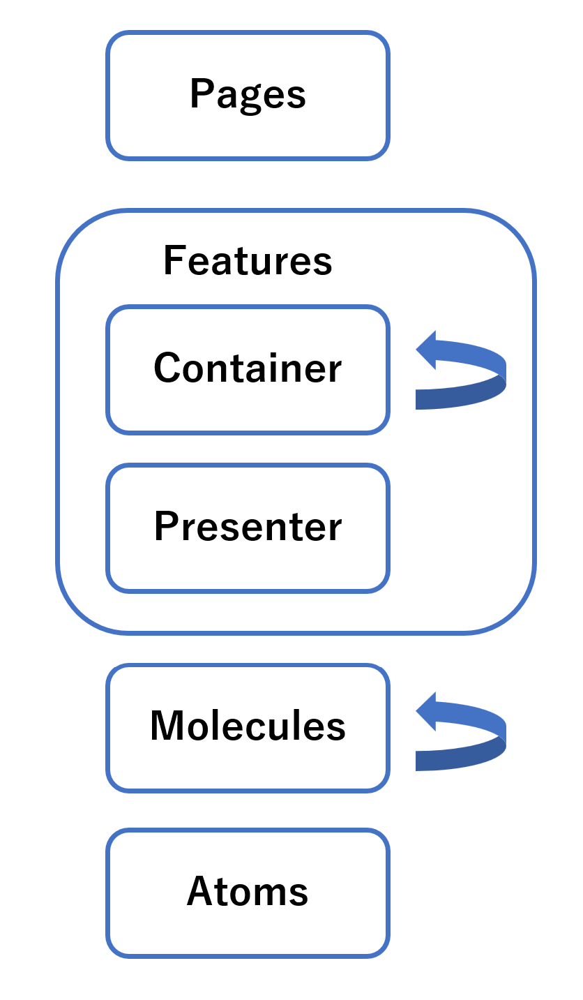

## Getting Started

1. yarn
2. yarn dev

## ディレクトリ構成

atoms と molecules は ui ディレクトリに統一していいかも

## ルール

### 型定義する場所

- 基本ファイル内に書いて良い
- 2 回以上別のファイルから呼び出す場合は以下のどちらかに記述する
  - src/common/type.common.ts
  - src/components/features/[domain]/type.[domain].ts

### ディレクトリ名

- キャメルケース

### ファイル名

- コンポーネントはパスカルケース
- それ以外のファイルはキャメルケース

### CSS

- Color などの CSS 変数は以下に定義する
  - src/styles/variables.scss
- 背景色等全ページ共通の CSS は以下に定義する
  - src/styles/index.scss

## 依存ルール

## 参考

- [SPA Component の推しディレクトリ構成について語る](https://zenn.dev/yoshiko/articles/99f8047555f700)
- [SPA Component の推しディレクトリ構成について語る(Github)](https://github.com/yoshiko-pg/next-template)
